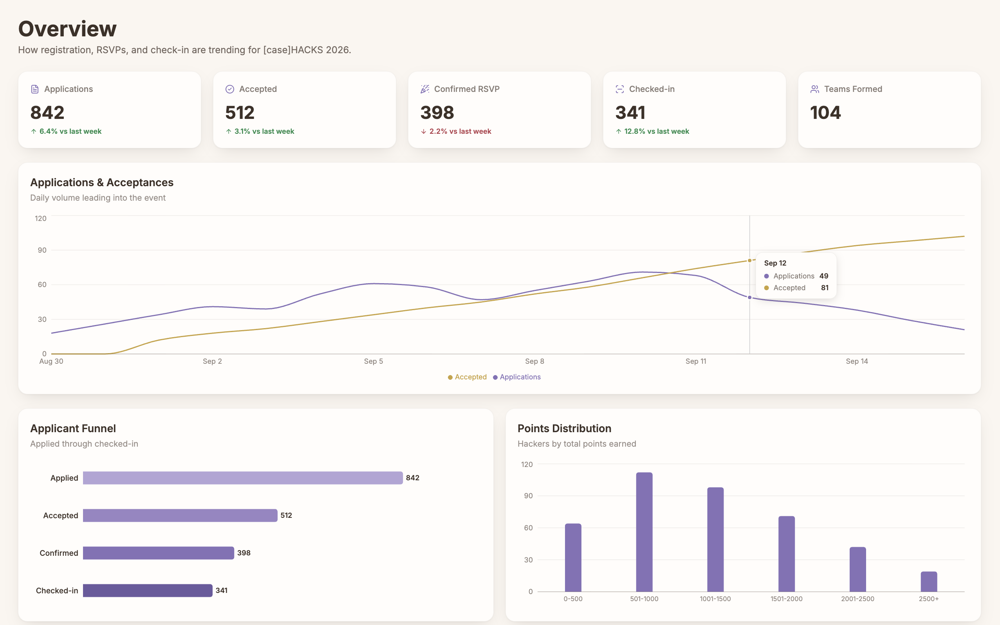
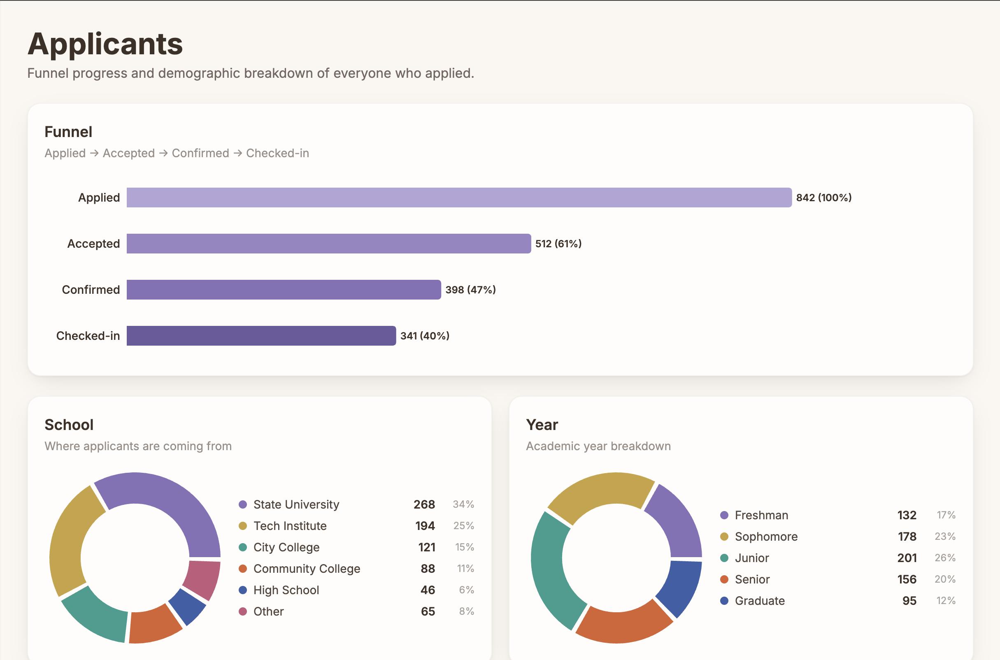
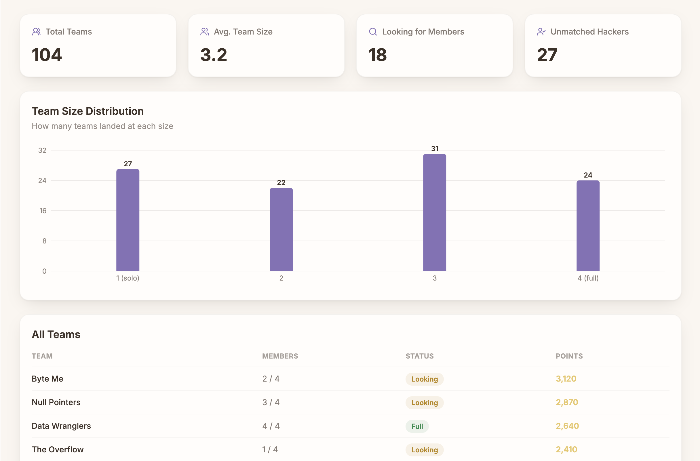
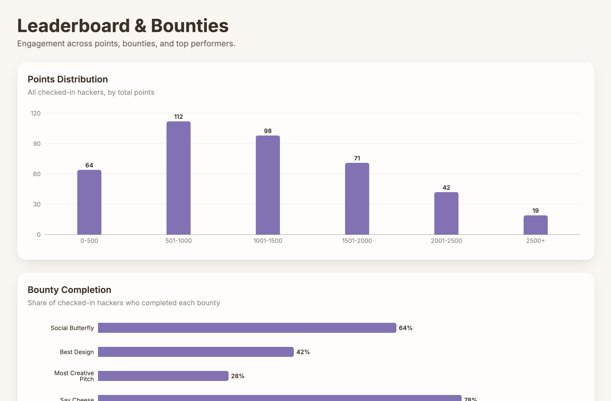
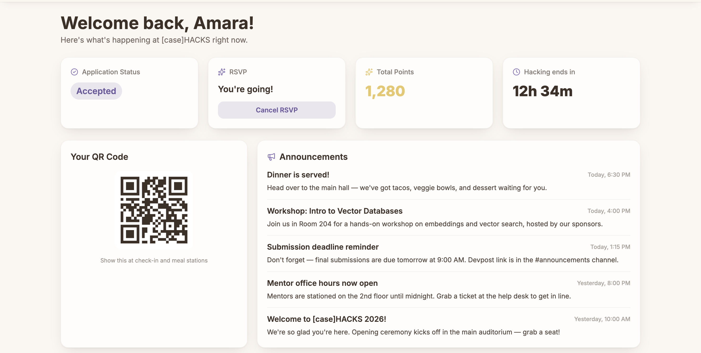
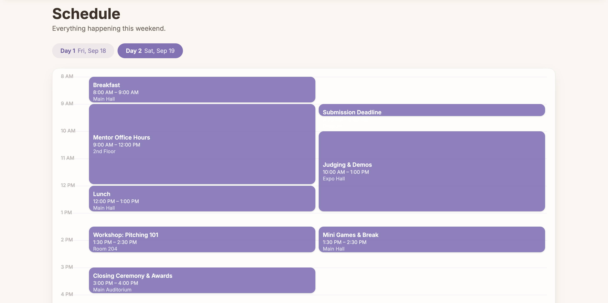
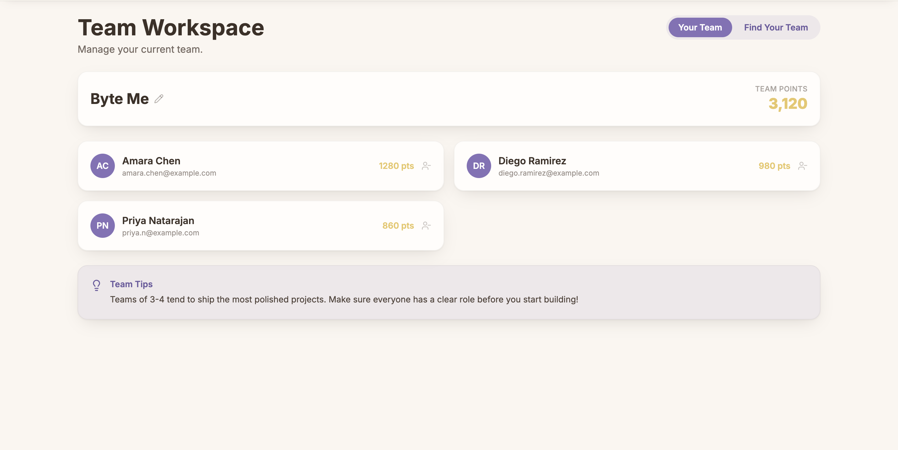
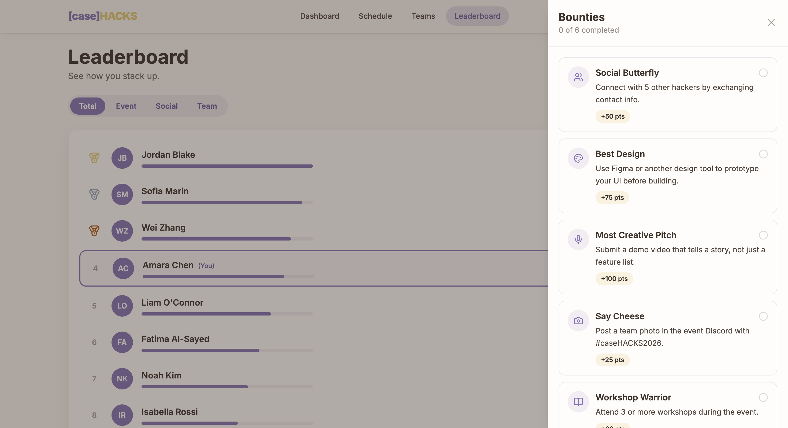

# Maintenance Notes:

- These are open source clones of the dashbaords built for [case]HACKS 2026. They cannot fully be used without our DB login keys, so feel free to look around and study how we built them! 

# CaseHacks Hackathon Platform

## Product Screenshots

### Organizer Dashboard

<table>
    <tr>
        <td></td>
        <td></td>
    </tr>
    <tr>
        <td align="center"><strong>Overview</strong></td>
        <td align="center"><strong>Applicants</strong></td>
    </tr>
    <tr>
        <td></td>
        <td></td>
    </tr>
    <tr>
        <td align="center"><strong>Teams</strong></td>
        <td align="center"><strong>Leaderboard and Bounties</strong></td>
    </tr>
</table>

### Hacker Portal

<table>
    <tr>
        <td></td>
        <td></td>
    </tr>
    <tr>
        <td align="center"><strong>Dashboard</strong></td>
        <td align="center"><strong>Schedule</strong></td>
    </tr>
    <tr>
        <td></td>
        <td></td>
    </tr>
    <tr>
        <td align="center"><strong>Team Workspace</strong></td>
        <td align="center"><strong>Leaderboard and Bounties</strong></td>
    </tr>
</table>


Two production-oriented dashboards for running a hackathon from application through event day: an organizer control plane and a participant-facing hacker portal.

## Main Features & Technical Skills

- A real time QR-Code scanning system used for:
    - Event check ins
    - Scaning hackers for networking points

- A real time leaderboard for:
    - Tracking trophy completion (for more points)
    - Tracking individual points
    - Tracking total team points

- An internal dashbaord for overviewing event and hacker logistics
    -  Used for talent acquisition by sonsors

- A team joining sytem with an optimized team matching algorithm:
    - Pairing teams with a balance of 2 men and 2 women
    - Pairing teams with a balance of 2 CS and 2 Business majors

## Resume Snapshot

- A function Auth system for logins,
- Built a full-stack hackathon operations platform used to manage applicants, events, check-ins, sponsors, teams, announcements, points, and participant workflows.
- Developed the organizer dashboard with Next.js, React, TypeScript, Tailwind CSS, Supabase, server actions, protected routes, realtime subscriptions, QR scanning, and file exports.
- Developed the hacker portal with React, Vite, React Router, Tailwind CSS, a Flask API, Supabase Auth, JWT validation, and responsive interactive views.
- Designed shared workflows around authenticated user records, event attendance, team membership, application status, resumes, social links, and gamification.

## Architecture and Technology

| Area | Implementation | Skills demonstrated |
| --- | --- | --- |
| Organizer frontend | Next.js App Router, React 19, TypeScript, Tailwind CSS | Server/client component boundaries, typed UI state, responsive layouts, form handling |
| Hacker frontend | React 19, Vite, React Router, Tailwind CSS | SPA routing, protected routes, context providers, reusable components, client-side data fetching |
| Backend services | Flask, Python, Supabase Python client | REST API design, request handling, CORS configuration, database orchestration |
| Data and authentication | Supabase Postgres, Supabase Auth, Supabase Storage | Relational queries, joins, RPC functions, session handling, signed URLs, file storage |
| Security | Next.js middleware, server actions, service-role server clients, JWT middleware | Route guards, approval-based authorization, bearer-token validation, secret isolation |
| Product integrations | QR scanner, QR code generation, JSZip, Sonner, Lucide icons | Browser camera APIs, downloadable exports, notifications, accessible interaction patterns |

## CHAdminDashboard

Organizer-facing tools for operating CaseHacks before and during the event.

### Features and Technical Skills

| Feature | What it provides | Technical skills demonstrated |
| --- | --- | --- |
| Organizer authentication and approval | Email/password sign-up and login with an administrator approval workflow. Unapproved users are denied access, while a designated approver can approve, annotate, or revoke organizer access. | Supabase Auth, middleware route protection, server-side authorization, approval-state modeling, secure redirects, form validation, error states |
| Operations dashboard | At-a-glance counts for check-ins, participants, and events, plus today's schedule and a recent check-in feed. | Parallel async data loading with `Promise.all`, typed state, loading and retry states, Supabase queries, responsive dashboard layout |
| Live check-in monitoring | Dashboard stats and recent check-ins update when new records are inserted. | Supabase Realtime `postgres_changes`, event-driven UI updates, optimistic state transformation, channel cleanup |
| Event management | Create, edit, delete, schedule, describe, locate, and assign attendance points to events. | CRUD workflows, server actions, modal forms, datetime-local handling, UTC conversion, client-side validation, toast notifications |
| Event QR check-in scanner | Select an event, scan a participant QR code, validate the check-in, and display event-specific recent check-ins. | React camera integration, QR decoding, async mutation flows, success/error feedback, event-scoped database queries |
| Applicant and hacker directory | Search and paginate hacker profiles, filter by application status, and open individual profile details. | Server-side filtering, debounced search, pagination, typed query results, URL-based detail routing, scalable list rendering |
| Sponsor view and resume export | Search applicants by name, email, or major; filter by university; inspect social links and resumes; export resumes as a ZIP file. | Service-role server client isolation, Supabase Storage signed URLs, paginated queries, normalization and deduplication, API route file responses, JSZip exports |
| Application question management | Customize the questions displayed on the participant application form. | Database-backed content management, server actions, reusable question list UI, dynamic form schema support |
| Team matching | Preview balanced teams of four, exclude no-shows, drag participants between proposed teams, review match statistics, and apply the final assignments. | Greedy matching algorithm, constraint-based grouping, TypeScript domain models, preview-before-commit workflow, drag-and-drop state management, transactional-style persistence |
| Admin feedback and resilience | Consistent loading placeholders, inline errors, retry actions, confirmation prompts, and toast feedback. | UX state design, asynchronous error handling, accessible status messaging, destructive-action confirmation |

Implementation: [CHAdminDashboard/Casehacks-dashboard](CHAdminDashboard/Casehacks-dashboard)

## CHHackerDashboard

Participant-facing portal for applying, preparing, collaborating, and engaging during the hackathon.

### Features and Technical Skills

| Feature | What it provides | Technical skills demonstrated |
| --- | --- | --- |
| Supabase authentication | Sign in, sign out, session restoration, and automatic creation of a corresponding application user record. | Supabase Auth, React Context, auth-state subscriptions, bearer-token propagation, lifecycle cleanup |
| Protected participant experience | Restricts application and dashboard routes based on authentication and configured access rules. | React Router nested routes, reusable `ProtectedRoute`, admin gating, environment-driven configuration |
| Dynamic application form | Loads application questions from the API and renders text, long text, number, URL, select, and checkbox inputs with required-field support. | Schema-driven rendering, controlled form state, validation attributes, REST API integration, authenticated submissions |
| Participant home dashboard | Shows announcements, application status, points, RSVP state, event check-ins, team information, and a submission countdown. | React hooks, composed API requests, interval timers, derived state, conditional rendering, responsive UI design |
| RSVP workflow | Lets accepted participants RSVP or cancel with confirmation and immediate UI feedback. | Authenticated POST requests, mutation state, confirmation UX, optimistic local state updates |
| Personal QR identity | Generates a QR code representing the participant's identity for event and networking workflows. | `qrcode.react`, stable identity serialization, reusable interactive dashboard components |
| Schedule and event calendar | Presents a multi-day hackathon schedule with day selection, overlapping event columns, a current-time marker, and event detail inspection. | Calendar layout algorithms, collision detection, time-zone-aware date formatting, memoized derived data, keyboard interaction |
| Team workspace | Browse available teams, create a team, update team details, join or leave teams, and manage invitations and requests. | REST CRUD operations, optimistic/refetched state, polling for membership changes, owner-aware controls, confirmation flows |
| Profile settings | Edit participant preferences and professional links such as dietary restrictions, GitHub, LinkedIn, and portfolio information. | Controlled forms, PUT requests, field allowlisting on the API, validation feedback, reusable form sections |
| Participant-to-participant QR scanning | Scan another participant's QR code to create a networking connection. | Browser camera access, scanner lifecycle control, authenticated API mutation, success/error feedback |
| Individual and team leaderboards | Rank participants and teams by total, event, social, or team points, with pagination and current-user/team rank highlighting. | Parallel API requests, client-side sorting, memoized rankings, pagination, derived ranking calculations, responsive data presentation |
| Bounties and gamification | Tracks scan/check-in achievements, awards interaction points, and exposes available bounties in the portal. | Relational reward modeling, Supabase RPC calls, threshold logic, idempotent completion checks, drawer-based UI |

Implementation: [CHHackerDashboard/hacker_portal](CHHackerDashboard/hacker_portal)

## Engineering Highlights

- **Full-stack integration:** Both dashboards share Supabase-backed users, events, teams, check-ins, points, bounties, and application data while using purpose-built interfaces for organizers and participants.
- **Authorization boundaries:** Organizer middleware protects routes, a separate approval table controls privileged access, and the Flask API validates Supabase JWTs on protected operations.
- **Operational scalability:** Server-side search and pagination keep large applicant and sponsor lists usable; bulk signed URL generation avoids one storage request per resume.
- **Real-world event workflows:** QR scanning, attendance tracking, no-show-aware team assignment, RSVP management, live dashboard updates, and downloadable resume packages address concrete event-day needs.
- **Responsive product UI:** Both portals include mobile-aware layouts, loading states, empty states, error recovery, confirmation flows, and accessible status feedback.

## Repository Structure

```text
CHAdminDashboard/Casehacks-dashboard/   Next.js organizer dashboard
CHHackerDashboard/hacker_portal/client/ React/Vite participant portal
CHHackerDashboard/hacker_portal/server/ Flask REST API and Supabase integration
```

## Local Development

### Organizer dashboard

```bash
cd CHAdminDashboard/Casehacks-dashboard
npm install
npm run dev
```

### Hacker portal client

```bash
cd CHHackerDashboard/hacker_portal/client
npm install
npm run dev
```

### Hacker portal API

```bash
cd CHHackerDashboard/hacker_portal/server
pip install -r requirements.txt
python app.py
```

Both applications require environment variables for Supabase credentials and their respective API configuration. See the dashboard-specific README files for project-specific setup details.
